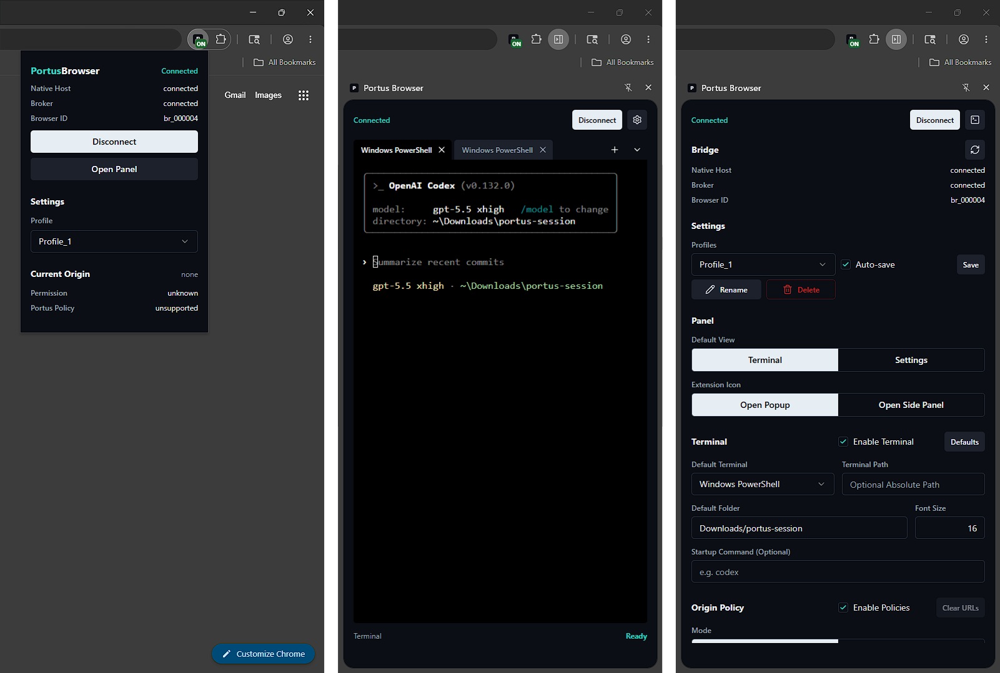

# Portus Browser

Portus Browser lets a user and an AI agent (Codex, Pi, Claude Code, and others) co-navigate one or more visible browser sessions from the terminal.

Any agent in your system can use the `portus-browser` CLI and Portus routes commands through a local Broker and the browser Extension allowing the user to have different settings, security profiles, and allow/block lists on different browser types. You can also use the built int Terminal Panel on the browser extension.

## What Portus Browser Does

Portus Browser lets an agent:

- list connected browsers
- list and inspect tabs
- open and navigate pages
- click, type, press keys, scroll, hover, and drag
- take page snapshots and screenshots
- inspect console and network data
- use saved browser recipes
- work across multiple Chrome, Edge, and Chromium windows at the same time.

Portus Browser is local first and the Broker runs on the user's machine.

## Quick Start

From the repo root:

1. Install deps and build:

```powershell
pnpm install --frozen-lockfile
pnpm build
```

2. Start Portus Broker and keep that terminal open:

```powershell
pnpm --filter @portus/broker exec node dist/index.js
```

3. In your browser, load the extension from `apps/portus-extension` (Developer mode -> Load unpacked), then copy the extension ID.

4. Install native host for that browser and extension ID:

```powershell
pnpm --filter @portus/dev-installer exec node dist/index.js apply --browser chrome --extension-id <extension-id>
```

5. Reload the extension (or restart browser), open the extension popup, and click Connect Bridge.

6. In a second terminal, verify connection:

```powershell
pnpm --filter @portus/browser-cli exec portus-browser browsers --json
```

If the list is empty, the Bridge is not connected yet in the extension popup.

## Main Parts

- Extension: the browser extension UI, popup, side panel, Settings view, Terminal view, and browser bridge.
- Broker: the local command router and source of truth for saved settings profiles.
- Browser CLI: the terminal command agents use. The command is `portus-browser`.
- Native hosts: local browser native messaging programs used by the Extension.
- Portus Browser skill: onboarding instructions that teach an AI agent how to use the CLI safely.





## Supported Browsers

Portus Browser targets Chromium-based browsers:

- Google Chrome
- Microsoft Edge
- Chromium

The extension must be installed separately in each browser type you want to use.

## Supported Platforms

The code is intended to work on:

- Windows
- Linux
- macOS

Native messaging registration is platform-specific. Use the installer command for each browser type and extension ID.

## Public Docs Map

- `docs/INSTALL.md`: build, install, and run instructions.
- `docs/SETTINGS_PROFILES.md`: security profiles and settings behavior.
- `docs/TROUBLESHOOTING.md`: common setup checks.
- `AGENT_SKILL.md`: how to install and use the Portus Browser skill.
