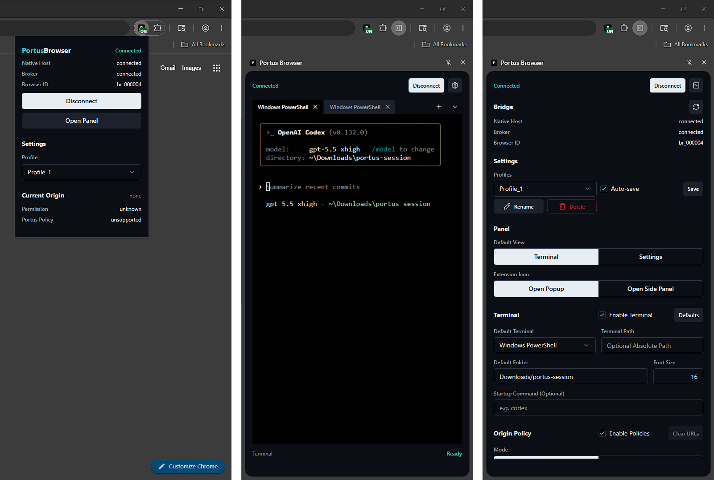

# Portus Browser

Portus Browser lets a user and an AI agent (Codex, Pi, Claude Code, and others) co-navigate one or more visible browser sessions from the terminal.

Any agent in your system can use the `portus-browser` CLI. Portus routes commands through a local Broker and browser Extension, allowing each browser to use its own settings profile, navigation policy, command policy, and terminal settings.

## What Portus Browser Does

Portus Browser lets an agent:

- list connected browsers
- list and inspect tabs
- open and navigate pages
- click, type, upload files, press keys, scroll, hover, and drag
- take page snapshots and screenshots
- observe, wait for, and act on controls in regular DOM, scriptable iframes, and recursively nested open/closed Shadow DOM while keeping those details transparent to CLI callers
- inspect console and network data, and monitor downloads observed during the current Bridge session
- use saved browser recipes
- work across multiple Chrome, Edge, Brave, and Chromium windows at the same time.

Portus Browser is local first and the Broker runs on the user's machine.

## Access And Policy

The Extension permanently requests Chrome host access for normal web pages through `"<all_urls>"`; there is no site-by-site Chrome permission request or revoke workflow. While the Bridge is connected, Portus navigation policy and command policy are the authorization boundary for agent actions. For selected state-changing commands, the active profile can additionally require one-time approval from the Extension popup or side panel. Approval is bound to the exact pending command and never bypasses either policy.

Navigation rules can match a URL by scheme, authority, wildcard host, exact URL, or URL prefix. Portus does not impose a built-in scheme restriction: users decide which browser-supported URLs to allow or block. A denied URL returns `NAVIGATION_BLOCKED`; protected pages and other targets the browser cannot expose return `BROWSER_ACCESS_DENIED`.

## Root configuration

Production entrypoints use `DEFAULT_PORTUS_CONFIG` plus supported environment overrides. `config/default.config.json` and `config/production.config.json` are validated examples; Portus does not load either file automatically.

The supported root configuration contract is:

- `broker`: `transport`, `pipeName`, `heartbeatIntervalMs`, `sessionTimeoutMs`
- `nativeHost`: `name`, `brokerPipeName`, `startBrokerIfMissing`, `connectTimeoutMs`
- `cli`: `output`
- `sessions`: `defaultTargetStrategy`
- `commands`: `timeoutMs`, `normalizeUrls`
- `security`: `allowedUploadRoots`, `requireBrokerToken`
- `policy`: `defaultPolicyMode`, `defaultAllowedNavigationRules`, `defaultBlockedNavigationRules`, `defaultCommandPolicy`, `sessionStepRetentionLimit`
- `events`: `retentionLimit`
- `logging`: `redactUrls`, `redactTitles`
- `terminal`: `enabled`, `defaultProfileId`, `manualTerminalPath`, `startupCommand`, `defaultWorkingDirectory`, `fontSize`, `maxSessions`, `idleTimeoutMs`

The former root `extension` and `tabs` subsections and other unconsumed legacy keys are rejected as `CONFIG_INVALID`. This is a hard cutover; no deprecated aliases are retained.

Supported environment overrides are `PORTUS_CLI_OUTPUT`, `PORTUS_BROKER_PIPE_NAME`, and `PORTUS_UPLOAD_ALLOWED_ROOTS`.

## Snapshots And Screenshots

Snapshots are structural by default. A normal `snapshot` command returns targeting data without capturing an image and without activating or focusing the target tab.

```powershell
portus-browser snapshot --browser 1 --tab-id <tabId> --json
```

Capture a screenshot only when visual information is needed:

```powershell
portus-browser screenshot --browser 1 --tab-id <tabId> --json
```

A snapshot can include an image explicitly:

```powershell
portus-browser snapshot --browser 1 --tab-id <tabId> --screenshot --json
portus-browser snapshot --browser 1 --tab-id <tabId> --screenshot --debugger --json
```

On `snapshot`, `--debugger` is valid only together with `--screenshot`; it selects the screenshot backend and does not control structural page collection. Normal screenshots of an inactive tab may temporarily activate that tab in its existing window, never focus the window, and restore the previous active tab when it is still safe to do so. Debugger screenshots target the tab without activation. Screenshot failures are returned as errors; Portus does not fabricate placeholder images.

Structural snapshots and element actions cover regular DOM, scriptable iframes, and recursively nested open/closed Shadow DOM. Agents continue to target returned elements only through `snapshotId` + `elementId`; Portus keeps frame, document, and Shadow DOM identity internal and rejects actions with `SNAPSHOT_STALE` when the captured document has been replaced.

## Page waits

`page.wait` can synchronize on element presence, visibility, control state, selection, or an exact field value while preserving frame and Shadow DOM matching:

```powershell
portus-browser wait --browser 1 --tab-id <tabId> --element-query "Loading" --element-state absent --json
portus-browser wait --browser 1 --tab-id <tabId> --element-query "Submit" --element-state enabled --json
portus-browser wait --browser 1 --tab-id <tabId> --role checkbox --element-state checked --json
portus-browser wait --browser 1 --tab-id <tabId> --role option --element-query "United States" --element-state selected --json
portus-browser wait --browser 1 --tab-id <tabId> --element-query "Status" --value "ready" --json
```

Supported element states are `present`, `absent`, `visible`, `hidden`, `enabled`, `disabled`, `checked`, `unchecked`, `selected`, and `unselected`. `--element-state` and `--value` require `--element-query` or `--role`, and they cannot be used together.

Positive states match when any applicable target satisfies the condition. `absent` requires no matching target in any scriptable frame. `hidden`, `disabled`, `unchecked`, and `unselected` require at least one applicable target and require every applicable target to satisfy the condition. Evaluation retains the existing 250 ms polling loop.


## File uploads

Browser upload has two independent gates. The Broker must have one or more allowed local roots, and the active extension settings profile must enable **Upload Files** under **CLI Commands**.

Set the allowed roots before starting the Broker:

```powershell
$env:PORTUS_UPLOAD_ALLOWED_ROOTS = "C:\Users\you\Documents\Approved Uploads"
pnpm --filter @portus/broker exec node dist/index.js
```

Use the operating system's path-list delimiter for multiple roots. Windows uses `;`; Linux and macOS use `:`.

Take a snapshot, select an `input[type="file"]` element, then upload one or more files:

```powershell
portus-browser snapshot --browser 1 --tab-id <tabId> --query "upload" --json
portus-browser upload --browser 1 --tab-id <tabId> --snapshot <snapshotId> --element <elementId> "C:\Users\you\Documents\Approved Uploads\document.pdf" --json
```

The Broker resolves each path before sending the command to the extension. It rejects missing paths, directories, symlink escapes, and files outside the configured roots with `UPLOAD_PATH_DENIED`. Multiple files require a file input with the `multiple` attribute. Portus returns selected basenames but never reads or returns file contents.


## Quick Start

From the repo root:

1. Install deps and build:

```powershell
pnpm install --frozen-lockfile
pnpm build
```

2. Start Portus Broker and keep that terminal open:

```powershell
pnpm --filter @portus/broker exec node dist/index.js
```

3. In your browser, load the extension from `apps/portus-extension` (Developer mode -> Load unpacked), then copy the extension ID.

4. Install native host for that browser and extension ID:

```powershell
pnpm --filter @portus/dev-installer exec node dist/index.js apply --browser chrome --extension-id <extension-id>
```

5. Reload the extension (or restart the browser). On a fresh install the Bridge is set to connect automatically and retries if the local connection is temporarily unavailable. Open the extension popup to verify its state; use **Connect** only if the Bridge was previously disconnected or is not currently set to connect.

6. In a second terminal, verify connection:

```powershell
pnpm --filter @portus/browser-cli exec portus-browser browsers --json
```

If the list is empty, check the Bridge state in the extension popup and the native-host/Broker setup.

## Main Parts

- Extension: the browser extension UI, popup, side panel, Settings view, Terminal view, and browser bridge.
- Broker: the local command router and source of truth for saved settings profiles.
- Browser CLI: the terminal command agents use. The command is `portus-browser`.
- Native hosts: local browser native messaging programs used by the Extension.
- Portus Browser skill: onboarding instructions that teach an AI agent how to use the CLI safely.





## Supported Browsers

Portus Browser targets Chromium-based browsers:

- Google Chrome
- Microsoft Edge
- Brave
- Chromium

The extension must be installed separately in each browser type you want to use.

## Supported Platforms

The code is intended to work on:

- Windows
- Linux
- macOS

Native messaging registration is platform-specific. Use the installer command for each browser type and extension ID.

## Public Docs Map

- `docs/INSTALL.md`: build, install, access disclosure, and run instructions.
- `docs/SETTINGS_PROFILES.md`: settings profiles and policy behavior.
- `docs/TROUBLESHOOTING.md`: common setup, policy, and browser-access checks.
- `AGENT_SKILL.md`: how to install and use the Portus Browser skill.
